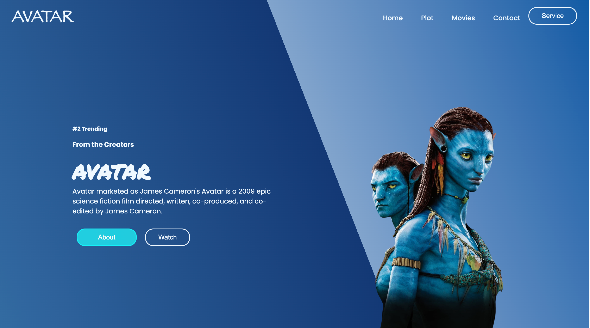
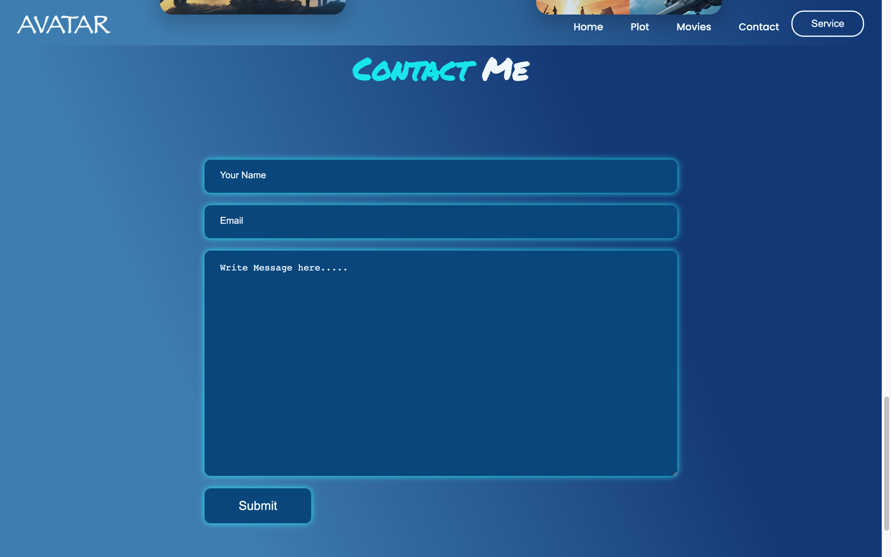

# AVATAR-Website






## Description

The AVATAR-Website project is a personal project created to refine front-end development skills. It showcases a website with an Avatar-themed design, serving as a portfolio piece to demonstrate your web development capabilities.

## Technologies Used

- HTML
- CSS

## Setup

To view this website locally:

1. Clone the repository to your local machine:

   git clone https://github.com/Shinan007/avatar-website.git

2. Navigate to the project folder:

   cd avatar-website

3. Open the `index.html` file in your favorite code editor (e.g., Visual Studio Code).

4. You can preview the website by opening `index.html` in your web browser.

## Usage

The AVATAR-Website is a static website that showcases an Avatar-themed design. Users can explore the website to appreciate the design and your front-end development skills.

## Contributing

Contributors are welcome! If you'd like to contribute to this project by adding functionality or improving its design, please follow these steps:

1. Fork the project to your GitHub account.
2. Create a new branch for your contributions:

   ```bash
   git checkout -b feature/Sharad Chauhan
   ```

3. Make your changes and commit them with descriptive messages.
4. Push your changes to your forked repository.
5. Create a pull request to merge your changes into the main project.

## License

This project is open-source and available under an open-source license.

## Acknowledgments

Special thanks to Apana College for teaching web development.

## Contact

If you have any questions or would like to get in touch, feel free to contact me:

- Phone: 9634879999
- LinkedIn: [www.linkedin.com/in/sharad-chauhan-24a62126a](www.linkedin.com/in/sharad-chauhan-24a62126a)

---

You can use this README file as a starting point for your project on GitHub. Don't forget to replace "your-username" with your actual GitHub username in the setup and contributing sections. Also, make sure to include your actual screenshot images (replace "screenshot1.png," "screenshot2.png," etc.) and update any URLs as needed.